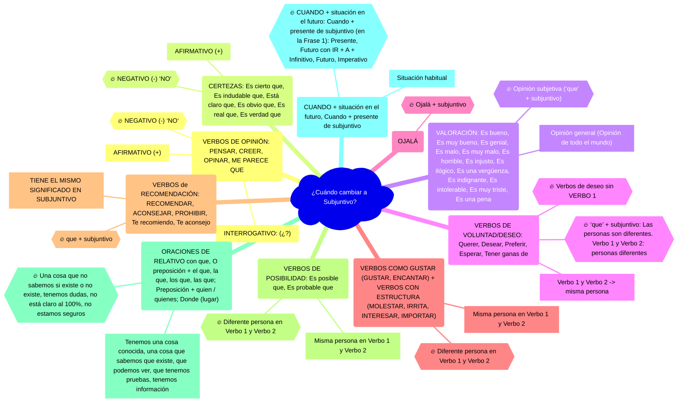

# ¿Cuándo cambiar a Subjuntivo?

```mermaid
mindmap
)"¿Cuándo cambiar a Subjuntivo?"(
    ("VERBOS DE OPINIÓN: PENSAR, CREER, OPINAR, ME PARECE QUE")
        ["AFIRMATIVO (+)"]
        ["INTERROGATIVO: (¿?)"]
        {{"🔥 NEGATIVO (-) ‘NO‘"}}
    ("CERTEZAS: Es cierto que, Es indudable que, Está claro que, Es obvio que, Es real que, Es verdad que")
        ["AFIRMATIVO (+)"]
        {{"🔥 NEGATIVO (-) ‘NO‘"}}
    ("VALORACIÓN: Es bueno, Es muy bueno, Es genial, Es malo, Es muy malo, Es horrible, Es injusto, Es ilógico, Es una vergüenza, Es indignante, Es intolerable, Es muy triste, Es una pena")
        ["Opinión general (Opinión de todo el mundo)"]
        {{"🔥 Opinión subjetiva (‘que’ + subjuntivo)"}}
    ("VERBOS DE VOLUNTAD/DESEO: Querer, Desear, Preferir, Esperar, Tener ganas de")
        ["Verbo 1 y Verbo 2 -> misma persona"]
        {{"🔥 ‘que’ + subjuntivo: Las personas son diferentes. Verbo 1 y Verbo 2: personas diferentes"}}
        {{🔥 Verbos de deseo sin VERBO 1}}
    ("OJALÁ")
        {{"🔥 Ojalá + subjuntivo"}}
    ("VERBOS COMO GUSTAR (GUSTAR, ENCANTAR) + VERBOS CON ESTRUCTURA (MOLESTAR, IRRITA, INTERESAR, IMPORTAR)")
        ["Misma persona en Verbo 1 y Verbo 2"]
        {{"🔥 Diferente persona en Verbo 1 y Verbo 2"}}
    ("VERBOS de RECOMENDACIÓN: RECOMENDAR, ACONSEJAR, PROHIBIR, Te recomiendo, Te aconsejo")
        ["TIENE EL MISMO SIGNIFICADO EN SUBJUNTIVO"]
        {{"🔥 que + subjuntivo"}}
    ("VERBOS DE POSIBILIDAD: Es posible que, Es probable que")
        ["Misma persona en Verbo 1 y Verbo 2"]
        {{"🔥 Diferente persona en Verbo 1 y Verbo 2"}}
    ("ORACIONES DE RELATIVO con que, O preposición + el que, la que, los que, las que; Preposición + quien / quienes; Donde (lugar)")
        ["Tenemos una cosa conocida, una cosa que sabemos que existe, que podemos ver, que tenemos pruebas, tenemos información"]
        {{"🔥 Una cosa que no sabemos si existe o no existe, tenemos dudas, no está claro al 100%, no estamos seguros"}}
    ("CUANDO + situación en el futuro, Cuando + presente de subjuntivo")
        ["Situación habitual"]
        {{"🔥 CUANDO + situación en el futuro: Cuando + presente de subjuntivo (en la Frase 1): Presente, Futuro con IR + A + Infinitivo, Futuro, Imperativo"}}

```
