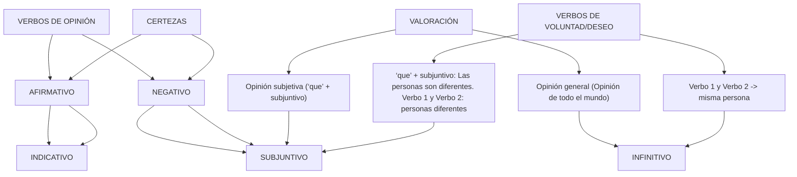
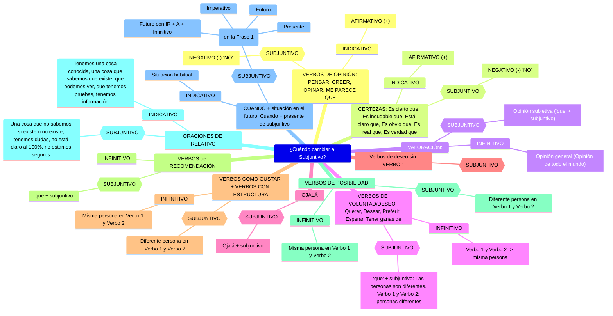
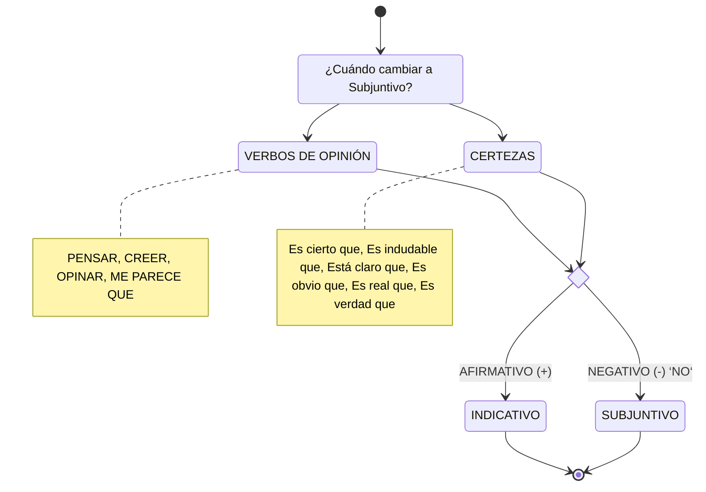

# Mermaid

## V1

```mermaid
flowchart
    OPINIÓN[VERBOS DE OPINIÓN]
    OPINIÓN --> AFIRMATIVO --> INDICATIVO
    OPINIÓN --> NEGATIVO --> SUBJUNTIVO
    
    CERTEZAS
    CERTEZAS --> AFIRMATIVO --> INDICATIVO
    CERTEZAS --> NEGATIVO --> SUBJUNTIVO
    
    VALORACIÓN
    VALORACIÓN --> VALORACIÓN1["Opinión general (Opinión de todo el mundo)"] --> INFINITIVO
    VALORACIÓN --> VALORACIÓN2["Opinión subjetiva (‘que’ + subjuntivo)"] --> SUBJUNTIVO

    DESEO["VERBOS DE VOLUNTAD/DESEO"]
    DESEO --> DESEO1["Verbo 1 y Verbo 2 -> misma persona"] --> INFINITIVO
    DESEO --> DESEO2["‘que’ + subjuntivo: Las personas son diferentes. Verbo 1 y Verbo 2: personas diferentes"] --> SUBJUNTIVO
```

## V2

```mermaid
mindmap
¿Cuándo cambiar a Subjuntivo?
    VERBOS DE OPINIÓN: PENSAR, CREER, OPINAR, ME PARECE QUE
        INDICATIVO
            ["AFIRMATIVO (+)"]
        {{SUBJUNTIVO}}
            ["NEGATIVO (-) ‘NO‘"]
    CERTEZAS: Es cierto que, Es indudable que, Está claro que, Es obvio que, Es real que, Es verdad que
        INDICATIVO
            ["AFIRMATIVO (+)"]
        {{SUBJUNTIVO}}
            ["NEGATIVO (-) ‘NO‘"]
    VALORACIÓN:
        INFINITIVO
            ["Opinión general (Opinión de todo el mundo)"]
        {{SUBJUNTIVO}}
            ["Opinión subjetiva (‘que’ + subjuntivo)"]
    VERBOS DE VOLUNTAD/DESEO: Querer, Desear, Preferir, Esperar, Tener ganas de
        INFINITIVO
            ["Verbo 1 y Verbo 2 -> misma persona"]
        {{SUBJUNTIVO}}
            ["‘que’ + subjuntivo: Las personas son diferentes. Verbo 1 y Verbo 2: personas diferentes"]
    OJALÁ
        {{SUBJUNTIVO}}
            ["Ojalá + subjuntivo"]
    Verbos de deseo sin VERBO 1
        {{SUBJUNTIVO}}
    VERBOS COMO GUSTAR + VERBOS CON ESTRUCTURA
        INFINITIVO
            Misma persona en Verbo 1 y Verbo 2
        {{SUBJUNTIVO}}
            Diferente persona en Verbo 1 y Verbo 2
    VERBOS de RECOMENDACIÓN
        INFINITIVO
        {{SUBJUNTIVO}}
            que + subjuntivo
    VERBOS DE POSIBILIDAD
        INFINITIVO
            Misma persona en Verbo 1 y Verbo 2
        {{SUBJUNTIVO}}
            Diferente persona en Verbo 1 y Verbo 2
    ORACIONES DE RELATIVO
        INDICATIVO
            Tenemos una cosa conocida, una cosa que sabemos que existe, que podemos ver, que tenemos pruebas, tenemos información.
        {{SUBJUNTIVO}}
            Una cosa que no sabemos si existe o no existe, tenemos dudas, no está claro al 100%, no estamos seguros.
    CUANDO + situación en el futuro, Cuando + presente de subjuntivo
        INDICATIVO
            Situación habitual
        {{SUBJUNTIVO}}
            CUANDO + situación en el futuro: Cuando + presente de subjuntivo (en la Frase 1)
                Presente
                Futuro con IR + A + Infinitivo
                Futuro
                Imperativo
```

## V3

```mermaid
stateDiagram-v2
    Cuándo: ¿Cuándo cambiar a Subjuntivo?
    OPINIÓN: VERBOS DE OPINIÓN
    CERTEZAS: CERTEZAS
    
    state v1 <<choice>>

    [*] --> Cuándo
    Cuándo --> OPINIÓN
    note right of OPINIÓN : PENSAR, CREER, OPINAR, ME PARECE QUE
    OPINIÓN --> v1
    v1 --> INDICATIVO: AFIRMATIVO (+)
    v1 --> SUBJUNTIVO: NEGATIVO (-) ‘NO‘

    Cuándo --> CERTEZAS
    note right of CERTEZAS : Es cierto que, Es indudable que, Está claro que, Es obvio que, Es real que, Es verdad que
    CERTEZAS --> v1
    
    INDICATIVO --> [*]
    SUBJUNTIVO --> [*]


```
