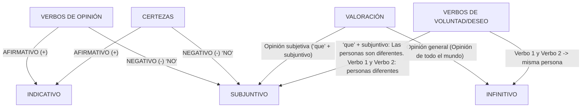
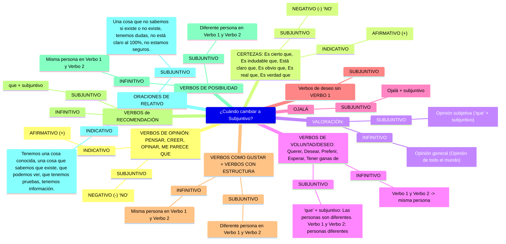

## Mermaid

```mermaid
flowchart
    OPINIÓN[VERBOS DE OPINIÓN]
    OPINIÓN -- "AFIRMATIVO (+)" --> INDICATIVO
    OPINIÓN -- "NEGATIVO (-) ‘NO‘" --> SUBJUNTIVO
    
    CERTEZAS
    CERTEZAS -- "AFIRMATIVO (+)" --> INDICATIVO
    CERTEZAS -- "NEGATIVO (-) ‘NO‘" --> SUBJUNTIVO
    
    VALORACIÓN
    VALORACIÓN -- "Opinión general (Opinión de todo el mundo)" --> INFINITIVO
    VALORACIÓN -- "Opinión subjetiva (‘que’ + subjuntivo)" --> SUBJUNTIVO

    DESEO["VERBOS DE VOLUNTAD/DESEO"]
    DESEO -- "Verbo 1 y Verbo 2 -> misma persona" --> INFINITIVO
    DESEO -- "‘que’ + subjuntivo: Las personas son diferentes. Verbo 1 y Verbo 2: personas diferentes" --> SUBJUNTIVO
```

```mermaid
mindmap
¿Cuándo cambiar a Subjuntivo?
    VERBOS DE OPINIÓN: PENSAR, CREER, OPINAR, ME PARECE QUE
        INDICATIVO
            ["AFIRMATIVO (+)"]
        SUBJUNTIVO
            ["NEGATIVO (-) ‘NO‘"]
    CERTEZAS: Es cierto que, Es indudable que, Está claro que, Es obvio que, Es real que, Es verdad que
        INDICATIVO
            ["AFIRMATIVO (+)"]
        SUBJUNTIVO
            ["NEGATIVO (-) ‘NO‘"]
    VALORACIÓN:
        INFINITIVO
            ["Opinión general (Opinión de todo el mundo)"]
        SUBJUNTIVO
            ["Opinión subjetiva (‘que’ + subjuntivo)"]
    VERBOS DE VOLUNTAD/DESEO: Querer, Desear, Preferir, Esperar, Tener ganas de
        INFINITIVO
            ["Verbo 1 y Verbo 2 -> misma persona"]
        SUBJUNTIVO
            ["‘que’ + subjuntivo: Las personas son diferentes. Verbo 1 y Verbo 2: personas diferentes"]
    OJALÁ
        SUBJUNTIVO
            ["Ojalá + subjuntivo"]
    Verbos de deseo sin VERBO 1
        SUBJUNTIVO
    VERBOS COMO GUSTAR + VERBOS CON ESTRUCTURA
        INFINITIVO
            Misma persona en Verbo 1 y Verbo 2
        SUBJUNTIVO
            Diferente persona en Verbo 1 y Verbo 2
    VERBOS de RECOMENDACIÓN
        INFINITIVO
        SUBJUNTIVO
            que + subjuntivo
    VERBOS DE POSIBILIDAD
        INFINITIVO
            Misma persona en Verbo 1 y Verbo 2
        SUBJUNTIVO
            Diferente persona en Verbo 1 y Verbo 2
    ORACIONES DE RELATIVO
        INDICATIVO
            Tenemos una cosa conocida, una cosa que sabemos que existe, que podemos ver, que tenemos pruebas, tenemos información.
        SUBJUNTIVO
            Una cosa que no sabemos si existe o no existe, tenemos dudas, no está claro al 100%, no estamos seguros.

```

