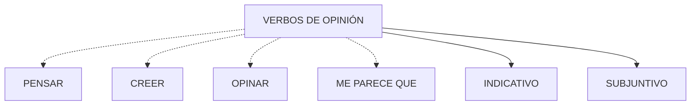
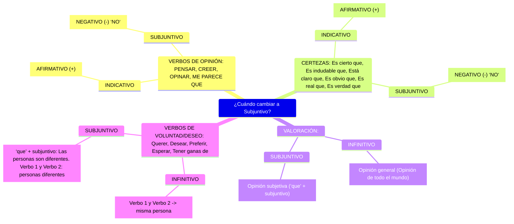

## Mermaid

```mermaid
flowchart
    OPINIÓN[VERBOS DE OPINIÓN]
    OPINIÓN -.-> PENSAR
    OPINIÓN -.-> CREER
    OPINIÓN -.-> OPINAR
    OPINIÓN -.-> MEPARECEQUE[ME PARECE QUE]
    
    OPINIÓN --> INDICATIVO
    OPINIÓN --> SUBJUNTIVO
```

```mermaid
mindmap
¿Cuándo cambiar a Subjuntivo?
    VERBOS DE OPINIÓN: PENSAR, CREER, OPINAR, ME PARECE QUE
        INDICATIVO
            ["AFIRMATIVO (+)"]
        SUBJUNTIVO
            ["NEGATIVO (-) ‘NO‘"]
    CERTEZAS: Es cierto que, Es indudable que, Está claro que, Es obvio que, Es real que, Es verdad que
        INDICATIVO
            ["AFIRMATIVO (+)"]
        SUBJUNTIVO
            ["NEGATIVO (-) ‘NO‘"]
    VALORACIÓN:
        INFINITIVO
            ["Opinión general (Opinión de todo el mundo)"]
        SUBJUNTIVO
            ["Opinión subjetiva (‘que’ + subjuntivo)"]
    VERBOS DE VOLUNTAD/DESEO: Querer, Desear, Preferir, Esperar, Tener ganas de
        INFINITIVO
            ["Verbo 1 y Verbo 2 -> misma persona"]
        SUBJUNTIVO
            ["‘que’ + subjuntivo: Las personas son diferentes. Verbo 1 y Verbo 2: personas diferentes"]
        
```

