# Mermaid

## V1

```mermaid
mindmap
¿Cuándo cambiar a Subjuntivo?
    VERBOS DE OPINIÓN: PENSAR, CREER, OPINAR, ME PARECE QUE
        INDICATIVO
            ["AFIRMATIVO (+)"]
            ["INTERROGATIVO: (¿?)"]
        {{SUBJUNTIVO}}
            ["NEGATIVO (-) ‘NO‘"]
    CERTEZAS: Es cierto que, Es indudable que, Está claro que, Es obvio que, Es real que, Es verdad que
        INDICATIVO
            ["AFIRMATIVO (+)"]
        {{SUBJUNTIVO}}
            ["NEGATIVO (-) ‘NO‘"]
    VALORACIÓN:
        INFINITIVO
            ["Opinión general (Opinión de todo el mundo)"]
        {{SUBJUNTIVO}}
            ["Opinión subjetiva (‘que’ + subjuntivo)"]
    VERBOS DE VOLUNTAD/DESEO: Querer, Desear, Preferir, Esperar, Tener ganas de
        INFINITIVO
            ["Verbo 1 y Verbo 2 -> misma persona"]
        {{SUBJUNTIVO}}
            ["‘que’ + subjuntivo: Las personas son diferentes. Verbo 1 y Verbo 2: personas diferentes"]
    OJALÁ
        {{SUBJUNTIVO}}
            ["Ojalá + subjuntivo"]
    Verbos de deseo sin VERBO 1
        {{SUBJUNTIVO}}
    VERBOS COMO GUSTAR + VERBOS CON ESTRUCTURA
        INFINITIVO
            Misma persona en Verbo 1 y Verbo 2
        {{SUBJUNTIVO}}
            Diferente persona en Verbo 1 y Verbo 2
    VERBOS de RECOMENDACIÓN
        INFINITIVO
            TIENE EL MISMO SIGNIFICADO EN SUBJUNTIVO
        {{SUBJUNTIVO}}
            que + subjuntivo
    VERBOS DE POSIBILIDAD
        INFINITIVO
            Misma persona en Verbo 1 y Verbo 2
        {{SUBJUNTIVO}}
            Diferente persona en Verbo 1 y Verbo 2
    ORACIONES DE RELATIVO
        INDICATIVO
            Tenemos una cosa conocida, una cosa que sabemos que existe, que podemos ver, que tenemos pruebas, tenemos información.
        {{SUBJUNTIVO}}
            Una cosa que no sabemos si existe o no existe, tenemos dudas, no está claro al 100%, no estamos seguros.
    CUANDO + situación en el futuro, Cuando + presente de subjuntivo
        INDICATIVO
            Situación habitual
        {{SUBJUNTIVO}}
            ["CUANDO + situación en el futuro: Cuando + presente de subjuntivo (en la Frase 1)"]
                Presente
                Futuro con IR + A + Infinitivo
                Futuro
                Imperativo
```


## V1.1

```mermaid
mindmap
¿Cuándo cambiar a Subjuntivo?
    VERBOS DE OPINIÓN: PENSAR, CREER, OPINAR, ME PARECE QUE
        INDICATIVO
            ["AFIRMATIVO (+)"]
            ["INTERROGATIVO: (¿?)"]
        {{SUBJUNTIVO}}
            {{"🔥 NEGATIVO (-) ‘NO‘"}}
    CERTEZAS: Es cierto que, Es indudable que, Está claro que, Es obvio que, Es real que, Es verdad que
        INDICATIVO
            ["AFIRMATIVO (+)"]
        {{SUBJUNTIVO}}
            {{"🔥 NEGATIVO (-) ‘NO‘"}}
    VALORACIÓN:
        INFINITIVO
            ["Opinión general (Opinión de todo el mundo)"]
        {{SUBJUNTIVO}}
            {{"🔥 Opinión subjetiva (‘que’ + subjuntivo)"}}
    VERBOS DE VOLUNTAD/DESEO: Querer, Desear, Preferir, Esperar, Tener ganas de
        INFINITIVO
            ["Verbo 1 y Verbo 2 -> misma persona"]
        {{SUBJUNTIVO}}
            {{"🔥 ‘que’ + subjuntivo: Las personas son diferentes. Verbo 1 y Verbo 2: personas diferentes"}}
    OJALÁ
        {{SUBJUNTIVO}}
            {{"🔥 Ojalá + subjuntivo"}}
    Verbos de deseo sin VERBO 1
        {{SUBJUNTIVO}}
    VERBOS COMO GUSTAR + VERBOS CON ESTRUCTURA
        INFINITIVO
            Misma persona en Verbo 1 y Verbo 2
        {{SUBJUNTIVO}}
            {{"🔥 Diferente persona en Verbo 1 y Verbo 2"}}
    VERBOS de RECOMENDACIÓN
        INFINITIVO
            TIENE EL MISMO SIGNIFICADO EN SUBJUNTIVO
        {{SUBJUNTIVO}}
            {{"🔥 que + subjuntivo"}}
    VERBOS DE POSIBILIDAD
        INFINITIVO
            Misma persona en Verbo 1 y Verbo 2
        {{SUBJUNTIVO}}
            {{"🔥 Diferente persona en Verbo 1 y Verbo 2"}}
    ORACIONES DE RELATIVO
        INDICATIVO
            Tenemos una cosa conocida, una cosa que sabemos que existe, que podemos ver, que tenemos pruebas, tenemos información.
        {{SUBJUNTIVO}}
            {{"🔥 Una cosa que no sabemos si existe o no existe, tenemos dudas, no está claro al 100%, no estamos seguros."}}
    CUANDO + situación en el futuro, Cuando + presente de subjuntivo
        INDICATIVO
            Situación habitual
        {{SUBJUNTIVO}}
            {{"🔥 CUANDO + situación en el futuro: Cuando + presente de subjuntivo (en la Frase 1)"}}
                Presente
                Futuro con IR + A + Infinitivo
                Futuro
                Imperativo
```



## V2
```mermaid
flowchart
    OPINIÓN[VERBOS DE OPINIÓN]
    OPINIÓN --> AFIRMATIVO --> INDICATIVO
    OPINIÓN --> NEGATIVO --> SUBJUNTIVO
    
    CERTEZAS
    CERTEZAS --> AFIRMATIVO --> INDICATIVO
    CERTEZAS --> NEGATIVO --> SUBJUNTIVO
    
    VALORACIÓN
    VALORACIÓN --> VALORACIÓN1["Opinión general (Opinión de todo el mundo)"] --> INFINITIVO
    VALORACIÓN --> VALORACIÓN2["Opinión subjetiva (‘que’ + subjuntivo)"] --> SUBJUNTIVO

    DESEO["VERBOS DE VOLUNTAD/DESEO"]
    DESEO --> DESEO1["Verbo 1 y Verbo 2 -> misma persona"] --> INFINITIVO
    DESEO --> DESEO2["‘que’ + subjuntivo: Las personas son diferentes. Verbo 1 y Verbo 2: personas diferentes"] --> SUBJUNTIVO
```

## V3

```mermaid
stateDiagram-v2
    Cuándo: ¿Cuándo cambiar a Subjuntivo?
    OPINIÓN: VERBOS DE OPINIÓN - PENSAR, CREER, OPINAR, ME PARECE QUE
    CERTEZAS: CERTEZAS - Es cierto que, Es indudable que, Está claro que, Es obvio que, Es real que, Es verdad que

    state v1 <<choice>>

    [*] --> Cuándo
    Cuándo --> OPINIÓN
    OPINIÓN --> v1
    v1 --> INDICATIVO: AFIRMATIVO (+)
    v1 --> SUBJUNTIVO: NEGATIVO (-) ‘NO‘

    Cuándo --> CERTEZAS
    CERTEZAS --> v1
    
    INDICATIVO --> [*]
    SUBJUNTIVO --> [*]


```


## V4

```mermaid
mindmap
¿Cuándo cambiar a Subjuntivo?
    VERBOS DE OPINIÓN: PENSAR, CREER, OPINAR, ME PARECE QUE
        ["AFIRMATIVO (+)"]
            INDICATIVO
        ["NEGATIVO (-) ‘NO‘"]
            {{SUBJUNTIVO}}
    CERTEZAS: Es cierto que, Es indudable que, Está claro que, Es obvio que, Es real que, Es verdad que
        ["AFIRMATIVO (+)"]
            INDICATIVO
        ["NEGATIVO (-) ‘NO‘"]
            {{SUBJUNTIVO}}
    VALORACIÓN:
        ["Opinión general (Opinión de todo el mundo)"]
            INFINITIVO
        ["Opinión subjetiva (‘que’ + subjuntivo)"]
            {{SUBJUNTIVO}}
    VERBOS DE VOLUNTAD/DESEO: Querer, Desear, Preferir, Esperar, Tener ganas de
        ["Verbo 1 y Verbo 2 -> misma persona"]
            INFINITIVO
        ["‘que’ + subjuntivo: Las personas son diferentes. Verbo 1 y Verbo 2: personas diferentes"]
            {{SUBJUNTIVO}}
    OJALÁ
        ["Ojalá + subjuntivo"]
            {{SUBJUNTIVO}}
    Verbos de deseo sin VERBO 1
        {{SUBJUNTIVO}}
    VERBOS COMO GUSTAR + VERBOS CON ESTRUCTURA
        Misma persona en Verbo 1 y Verbo 2
            INFINITIVO
        Diferente persona en Verbo 1 y Verbo 2
            {{SUBJUNTIVO}}
    VERBOS de RECOMENDACIÓN
        INFINITIVO
        que + subjuntivo
            {{SUBJUNTIVO}}
    VERBOS DE POSIBILIDAD
        Misma persona en Verbo 1 y Verbo 2
            INFINITIVO
        Diferente persona en Verbo 1 y Verbo 2
            {{SUBJUNTIVO}}
    ORACIONES DE RELATIVO
        Tenemos una cosa conocida, una cosa que sabemos que existe, que podemos ver, que tenemos pruebas, tenemos información.
            INDICATIVO
        Una cosa que no sabemos si existe o no existe, tenemos dudas, no está claro al 100%, no estamos seguros.
            {{SUBJUNTIVO}}
    CUANDO + situación en el futuro, Cuando + presente de subjuntivo
        Situación habitual
            INDICATIVO
        ["CUANDO + situación en el futuro: Cuando + presente de subjuntivo (en la Frase 1)"]
            Presente, Futuro con IR + A + Infinitivo, Futuro, Imperativo
                {{SUBJUNTIVO}}
```


